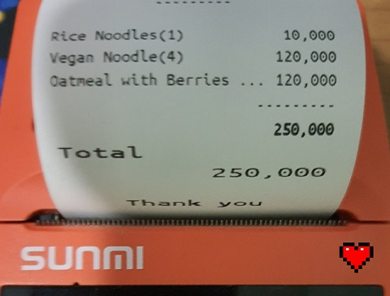

# Simple-POS

### ❤️❤️ [Online Demo](https://tcd93.github.io/flutter-pos) ❤️❤️

A mobile POS written in _Flutter_, suitable for small cafe/restaurant, fully offline.

**Tested & printable on **Sunmi V1S** device.**

**Support:**

- Android
- Web (unable to print, yet)
- English & Vietnamese (auto detect Locale)

---

## Install & Run

Get [flutter](https://flutter.dev/)

`flutter run`

**For web**

1. `flutter config --enable-web`
2. `flutter run -d chrome --web-renderer canvaskit`

## Testing

`flutter test`

## TODO

- [ ] Inventory journal
- [ ] Remote printing? (via Bluetooth)
